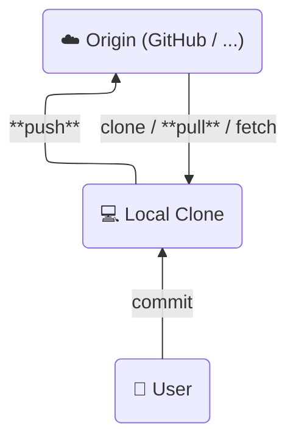
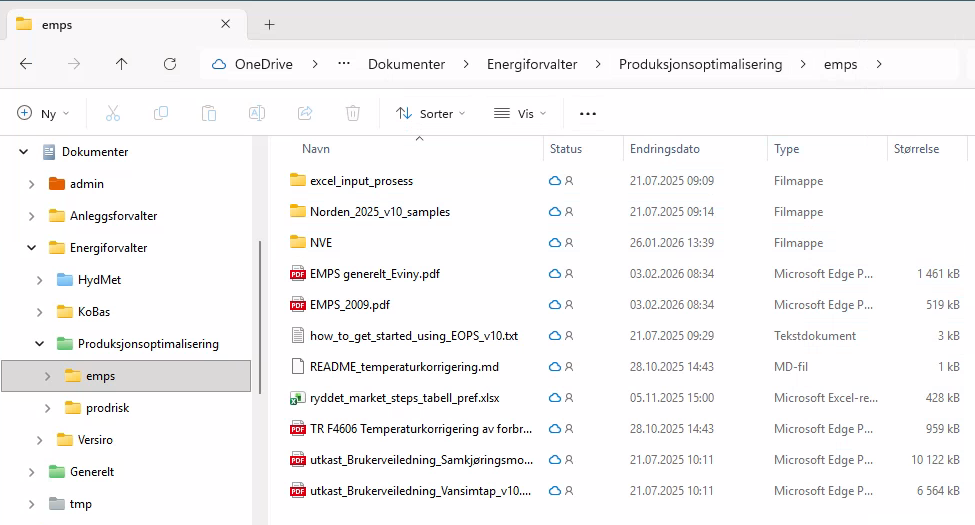
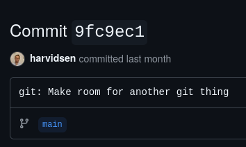
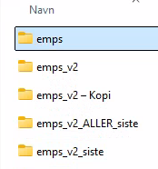
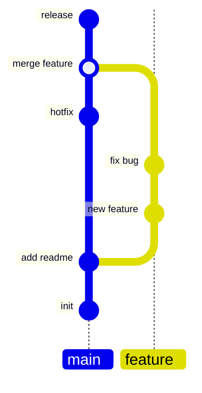

---
theme:
  override:
    default:
      margin:
        percent: 8
options:
  implicit_slide_ends: true
---

Introduksjon til git
===

- Motivasjon
- Konsepter
- Praksis

Motivasjon
===


**git** er et verktøy som lar oss

- Lagre kode og dokumentasjon i et sentralisert repository (**repo**)
- Versjonskontroll og frihet til å eksperimentere
- Arbeidsflyt for kvalitetsjekk og godkjenning
- Samarbeide _asynkront_ på prosjekter


Konsepter - Origin, lokal clone og interaksjon mellom de.
===




Konsepter - Filenes tilstand og commits
===

Hver endring som gjøres i repoet lagres i en **commit**. Hver commit anses som en tilstand av repo'et. Altså, hvordan så alle filene i mappen (og undermapper) ut på et gitt tidspunkt ut.




Konsepter - Filenes tilstand og commits
===

En commit kan se slik ut
```diff
 def my_function(number):
-    """ Add 1 to input number """
-    number = number + 1
+    """ Add 2 to input number and return the square of the result"""
+    number = (number + 2)**2
     return number
```

Og er tilknyttet informasjon som hvem som gjorde endringen, når den ble gjort og beskrivende tekst fra den som gjorde endringen. 




Konsepter - Branch
===
En branch er en kopi av repo, som tar utgangspunkt i en commit på en annen branch. Vanlig praksis er å ha én hovedbranch (main) der andre brancher tar utgangspunkt i hovedbranch.

Det _nesten_ det samme som dette



Men, vi kommer tilbake til hvordan vi unngår en slik situasjon.


Konsepter - Commit, branch og merge
===



Praksis
===

Vi skiller mellom git og GitHub.

- git er et verktøy for å gjøre git kommandoer og interagere med **origin**.

- GitHub er en git repository hosting service
  - **origin**


Praksis - Verktøy
===


# Git

Ulike verktøy, men alle gjør det samme

- [`git` cli]((https://git-scm.com/downloads))
- `lazygit`
- VSCode
- Andre grafiske grensesnitt med git integrasjon
- Ikke så farlig akkurat hvilket verktøy, alt bruker git cli i bakgrunnen.

-> Praksis?
  - Hvis du liker en pen visuell museklikk-opplevelse -> VSCode med GitLens extension.
  - Eller terminal hotkey-opplevelse -> `lazygit`

# GitHub

- [GitHub](https://github.com)
- [`gh`](https://cli.github.com/) cli for å ha GitHub spesifikke ting i terminal. 
  - Dette er et tillegg til `git` cli


# Operasjoner
For å teste ut konseptene i denne guiden kan du se på [howto dokumentet](howto.md) som lister opp nyttige kommandoer med git kommandolinjeverktøyet.


Praksis - Kodekraft
===


- Husk å sørge for at ting er oppdatert
- Alltid jobb på en *feature branch*
- Merge til main via Pull Request

Praksis - Kodekraft arbeidsflyt
===

# Første gang i nytt repo
- clone
  - `gh repo clone harvidsen/teach`

# Alltid
- pull latest main
  - `git pull`
- make new branch
  - `git checkout -b some-branch-name`
- make changes and commits
  - `git add file.txt`
  - `git commit -m "Some message"`
- push commited
  - `git push`
- Pull Request and review
- merge

# Når noe er feil
- blame


Praksis - Pull Request
===
GitHub lar oss opprette Pull Request (PR) for å ta endringer fra utviklerbranch over på hovedbranch. Dette gjøres når en utviklingsoppgave er ferdig, og man er klar for å bruke den nye koden i produksjonsmiljø. 

Dette er et kontrollsteg før man **merger** endringer fra utviklerbranch til hovedbranch.

Én PR består av én eller flere commits, og inkluderer gjerne en overordnet beskrivelse om hva som har blitt gjort.

Lages for eksempel [her](https://github.com/harvidsen/teach/pulls).

# Typiske krav til PR
- Review av kollegaer
- Automatiserte tester
- Ingen endringskonflikter med hovedbranch


Praksis - Eksempel
===
Vi kan se litt på eksempel hvis vi har tid.


Git filosofi
===

- Versjonskontrollert utvikling
- Inkrementelle og bevisste steg
  - Hva er målet?
- Synkronisere jevnlig
  - Bra for deg, og bra for andre
- No Free Lunch


Konklusjon
===

- **git** : Universelt verktøy for å drive versjonskontrollert utvikling.
- **GitHub** : Vår valgte _git provider_ der vi lagrer våre repositories.
- **Pull Request** : Kontrollsjekket oppdatering av repository.


Mer docs
===

- [Liste over ting man kan gjøre](https://github.com/harvidsen/teach/blob/main/git/introgit/howto.md)
- [Denne presentasjonen](https://github.com/harvidsen/teach/blob/main/git/introgit/README.md)
- Våre dokumenterte krav for kode i produksjon, [RFC15](https://github.com/fornybar/rfcs/blob/main/0015-production-requirements/0015-production-requirements.md).
