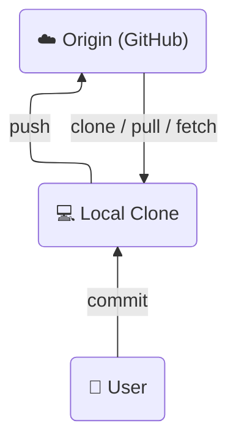
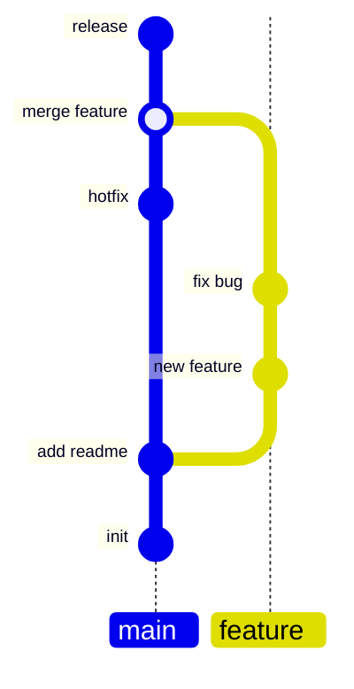

---
theme:
  override:
    default:
      margin:
        percent: 8
options:
  implicit_slide_ends: true
---

Git og GitHub gode praksiser
===

- Kort forklare git konsepter
- Vise hvordan vi bruker dette i _Kodekraft_
- Gevinst

Origin, lokal clone og interaksjon mellom de.
===

Commit, branch og merge
===

Git verktøy
===

# Git

Ulike verktøy, men alle gjør det samme

- `git` cli
- `lazygit`
- VSCode
- Andre IDE'er med git integrasjon
- Ikke så farlig akkurat hvilket verktøy, alt bruker git cli i bakgrunnen.

-> Praksis?
  - Hvis du liker en pen visuell museklikk-opplevelse -> VSCode med GitLens extension.
  - Eller terminal hotkey-opplevelse -> `lazygit`

# GitHub

- [`gh`](https://cli.github.com/) cli for å ha GitHub spesifikke ting i terminal. 
  - Dette er et tillegg til `git` cli

Kodekraft praksis
===

- Husk å sørge for at ting er oppdatert
- Alltid jobb på en *feature branch*
- Merge til main via Pull Request

En vanlig  arbeidsflyt
===

- clone
  - `gh repo clone harvidsen/teach`
- pull latest main
- make new branch
- make changes
  - Untracked, unstaged, staged, commit
- push commited
- Pull Request
- merge
- blame

---

Demo med VSCode og gitlens extension commit graph

Gevinster
===

- Kommer av seg selv
  - Versjonskontroll
  - Samarbeid og deling
- PR sjekker
- Dokumentasjon sammen med kode
- Single source of truth

Mer docs
===

- Våre dokumenterte krav for kode i produksjon, [RFC15](https://github.com/fornybar/rfcs/blob/main/0015-production-requirements/0015-production-requirements.md).

- [Liste over ting man kan gjøre](https://github.com/harvidsen/teach/blob/main/git/introgit/howto.md)
